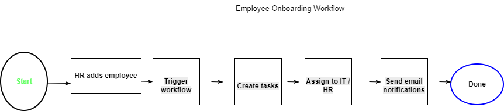

# SharePoint HR Workflow Automation
Built as part of a real-world workflow automation project using SharePoint and Power Automate.
## Workflow Diagram
This diagram illustrates the automated onboarding workflow from employee creation to task completion.

## Overview
This project automates employee onboarding and offboarding processes using SharePoint and Power Automate.

## Features
- Automated task assignment
- Email notifications
- Workflow tracking

## Tools
- Microsoft SharePoint
- Power Automate

## Workflow Example

### Onboarding
1. HR adds a new employee
2. Workflow triggers automatically
3. Tasks assigned to departments
4. Notifications sent

### Offboarding
1. HR marks employee as leaving
2. Access removal tasks triggered
3. IT and HR notified
4. Offboarding checklist completed

## Workflow Diagram
(Add your diagram image here)
## Outcome
- Reduced manual HR tasks
- Improved workflow efficiency
- Automated notifications and task tracking
## Screenshots
(Add SharePoint and Power Automate screenshots here)

## Outcome
- Reduced manual HR work
- Improved process efficiency
- Better task tracking
